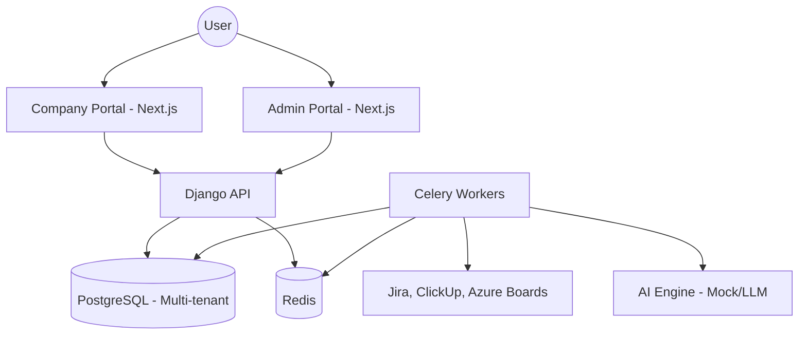

# Architecture

> Auto-generated by /map on 2026-02-13

## Overview

DMT-SLDP is a multi-tenant SaaS platform designed to unify Quality Enforcement (DMT) and Productivity Measurement (SLDP). It provides real-time compliance monitoring and AI-powered insights for engineering teams by aggregating data from various Project Management (Jira, ClickUp, Azure Boards) and Git tools.

## Components

### Backend (Django)
- **Purpose:** Core business logic, multi-tenant management, data persistence, and API endpoints.
- **Location:** `backend/`
- **Key Modules:**
    - `core/`: Global settings, URL routing, and ASGI/WSGI configuration.
    - `tenants/`: Multi-tenancy logic using `django-tenants` (schema-per-tenant).
    - `users/`: Custom user model and JWT-based authentication.
    - `data/`: The heart of the platform, containing:
        - `models.py`: Normalized schema for WorkItems, Sprints, Integrations, and RetentionPolicies.
        - `connectors/`: Abstraction layer for fetching data from external PM tools.
        - `engine/`: Logic for DMT compliance (rules-based validation).
        - `ai/`: AI service for generating developer insights and forecasts.
        - `tasks.py`: Celery tasks for background data synchronization and cleanup.

### Frontend (Next.js)
- **Purpose:** Secure portals for platform administration and company-level analytics.
- **Location:** `frontend/`
- **Portals:**
    - `admin/`: Tenant onboarding and system configuration.
    - `app/`: Interactive dashboard for leaders and developers featuring real-time charts (Recharts) and AI panels.

## Data Flow

1. **Onboarding:** Platform Admin creates a Tenant; `django-tenants` creates a dedicated PostgreSQL schema.
2. **Integration:** User configures a PM source (e.g., Jira); credentials stored in the `Integration` model.
3. **Sync (ETL):** Celery Beat triggers `run_all_integrations_sync`, spawning workers to fetch data via `ConnectorFactory`.
4. **Processing:** Fetched data is normalized into `WorkItem` models and passed through the `ComplianceEngine` for DMT flagging.
5. **Insight Generation:** `AIService` processes aggregated metrics to generate suggestions and forecasting.
6. **Real-time Delivery:** Metrics and insights are pushed to the Company Portal via WebSockets (Django Channels) and updated in the UI via the `useWebSocket` hook.

## Integration Points

| Service | Type | Purpose |
|---------|------|---------|
| Jira | REST API | Primary source for work items and sprints. |
| ClickUp | REST API | Secondary source for task management. |
| Azure Boards | REST API | Enterprise source using Entra ID OAuth. |
| AIService (Mock) | Python Wrapper | Generates suggested actions and forecasts. |

## Technical Debt

- [ ] **AI Maturity**: AIService is currently a mock; requires production LLM integration.
- [ ] **WebSocket Stream**: Real-time telemetry consumers need full multi-tenant implementation.
- [ ] **Security Hardening**: Implementation of CSRF protection and secure cookie handling.
- [ ] **Environment Configuration**: Frontend hardcoded URLs need to be moved to environment variables.

## Conventions

**Naming:** PEP 8 for Python; CamelCase for React components.
**Structure:** Domain-driven directory organization within the `data` app.
**Testing:** Verification reports documented in `.gsd/phases/`.
