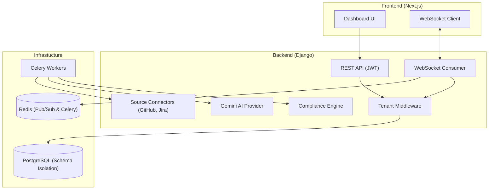

# Architecture

> Auto-generated by /map on 2026-02-13

## Overview
DMT-SLDP is a multi-tenant platform designed for Software Lifecycle Development Performance (SLDP) tracking. It aggregates data from various sources (Jira, GitHub) to provide AI-powered compliance insights and real-time telemetry updates.

## Components

### Multi-tenant Core
- **Purpose:** Enforces strict data isolation using PostgreSQL schemas.
- **Location:** `backend/tenants/`, `backend/core/settings.py`
- **Dependencies:** `django-tenants`

### Data Synchronization Pipeline
- **Purpose:** Fetches data from external sources and populates the tenant schema.
- **Location:** `backend/data/tasks.py`, `backend/data/connectors/`
- **Integrations:** GitHub (PRs), Jira (WorkItems - mock/init)

### Compliance & AI Engine
- **Purpose:** Evaluates development quality via rules and LLM insights.
- **Location:** `backend/data/engine/`, `backend/data/ai/`
- **Resilience:** Implements exponential backoff and circuit breakers for AI calls.

### Real-time Telemetry
- **Purpose:** Streams live WorkItem and Insight updates to frontend dashboards.
- **Location:** `backend/data/consumers.py`, `backend/data/signals.py`
- **Protocol:** WebSockets via Django Channels + Redis.

## Data Flow
1. **Sync Cycle:** Celery tasks trigger source connectors → normalise data → save to tenant-specific tables.
2. **Analysis:** Post-sync signals trigger `ComplianceEngine` and `GeminiAIProvider`.
3. **Broadcast:** ORM signals (`post_save`) push updates to Redis channel layers.
4. **Consumption:** `TelemetryConsumer` broadcasts to tenant-isolated WebSocket groups.

## Integration Points
| Service | Type | Purpose |
|---------|------|---------|
| Google Vertex AI | API | Generative AI Compliance Insights (Gemini 1.5 Pro) |
| GitHub | API | PR Tracking and Traceability (PAT Auth) |
| PostgreSQL | DB | Schema-level multi-tenancy |
| Redis | MQ/Cache | Celery Broker and WebSocket Channel Layer |

## Technical Debt
- [ ] **Jira OAuth**: Currently using basic/mocked authentication.
- [ ] **Typed Telemetry**: Broadcast payloads are dictionary-based and lack strict typing.
- [ ] **Signal Extraction**: Compliance engine requires deeper CI/CD signal integration from GitHub.
